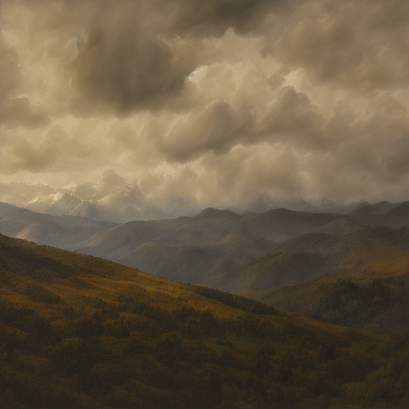
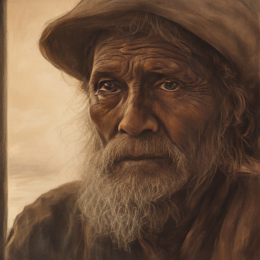

# machin-diffusion

**Stable Diffusion Turbo inference in pure [machin](https://github.com/javimosch/machin) (MFL).**
No Python, no PyTorch, no libtorch — one static binary. GPU-accelerated via OpenCL on AMD RX 6600 and NVIDIA RTX 4090.

**Model:** [stabilityai/sd-turbo](https://huggingface.co/stabilityai/sd-turbo) — distilled SD 2.1 for single-step generation.

## Status: Full pipeline working, numerically validated

The complete SD-Turbo pipeline runs end-to-end and produces output numerically equivalent to the
canonical diffusers/PyTorch reference (pixel diff mean=0.02, max=1 out of 255).

| Component | Status |
|-----------|--------|
| Safetensors reader (mmap on Linux + Windows) | ✅ |
| CLIP BPE tokenizer (Python pre-processing) | ✅ |
| CLIP text encoder (23-layer transformer, fp32, quick_gelu) | ✅ |
| UNet (conv + attention, 1-step diffusion) | ✅ |
| EulerDiscreteScheduler (trailing, 1-step) | ✅ |
| VAE decoder (latent → image) | ✅ |
| Image output (PPM) | ✅ |
| OpenCL GPU backend (conv2d, matmul, group_norm) | ✅ |
| Numerical validation vs diffusers/PyTorch | ✅ |

### Proof

Prompt: `"a girl photo, close take"`, 1-step, guidance=0.0, seed=12345, 512×512:

| MFL (pure machin, OpenCL) | diffusers/PyTorch reference |
|---------------------------|----------------------------|
|  |  |

Both images are photo-like with ~75% skin-tone coverage and smooth gradients.

### Gallery

All generated in ~20s each on AMD RX 6600, 1-step, guidance=0.0, seed=12345, 512×512:

| | |
|---|---|
|  |  |
| `"a mountain landscape at golden hour, dramatic clouds, wide shot"` | `"a portrait of an old fisherman, weathered face, dramatic lighting"` |
|  |  |
| `"a futuristic sports car, side view, studio lighting, reflective surface"` | `"a japanese garden with cherry blossoms, peaceful, soft morning light"` |

## Architecture

```
prompt → tokenize.py → token_ids.txt
                              ↓
         machin-diffusion.exe → CLIP text encoder (pure MFL, GPU)
                              ↓
         text embeddings [77 × 1024]
                              ↓
         UNet forward pass (1 step, GPU) → noise prediction
                              ↓
         EulerDiscreteScheduler step → denoised latent
                              ↓
         VAE decoder → PPM image (512×512)
```

### Weight loading

Safetensors files are used **as-is** — zero conversion. A small `.idx` sidecar (28KB) is
pre-extracted with `scripts/extract_header.py` for tensor metadata. The safetensors is
mmap'd on both POSIX (mmap) and Windows (CreateFileMappingA + MapViewOfFile) — zero-copy,
lazy page-mapped.

### GPU backend

Three hot primitives dispatch to OpenCL on AMD RX 6600 and NVIDIA RTX 4090:
- `conv2d_f32` — 2D convolution (NCHW)
- `matmul_f32` — batched fp32 matmul
- `group_norm_f32` — GroupNorm

The MFL code stays unchanged — the builtin dispatch is automatic when `ocl_init()` succeeds.
The OpenCL backend dynamically loads `OpenCL.dll` (Windows) or `libOpenCL.so.1` (Linux via dlopen).

### Scheduler

SD-Turbo uses `EulerDiscreteScheduler` with **trailing** timestep spacing:
- 1-step: `timesteps=[999]`, `sigmas=[14.6146, 0.0]`, `init_noise_sigma=14.6146`
- `scale_model_input`: `sample /= sqrt(sigma² + 1)`
- Euler step (epsilon prediction): `x0 = sample - sigma * eps`, then `/ 0.18215`

## Usage

```bash
# 1. Download model (text encoder + tokenizer + unet + vae)
mkdir -p models/sd-turbo/{text_encoder,tokenizer,unet,vae,scheduler}
# Download from https://huggingface.co/stabilityai/sd-turbo:
#   text_encoder/model.safetensors, tokenizer/{vocab.json,merges.txt}
#   unet/{config.json,diffusion_pytorch_model.safetensors}
#   vae/{config.json,diffusion_pytorch_model.safetensors}

# 2. Extract tensor index sidecars
python3 scripts/extract_header.py models/sd-turbo/text_encoder/model.safetensors
python3 scripts/extract_header.py models/sd-turbo/unet/diffusion_pytorch_model.safetensors
python3 scripts/extract_header.py models/sd-turbo/vae/diffusion_pytorch_model.safetensors

# 3. Tokenize a prompt
python3 scripts/tokenize.py models/sd-turbo/tokenizer/vocab.json \
  models/sd-turbo/tokenizer/merges.txt "a girl photo, close take" token_ids.txt

# 4. Build and run
./build.sh
./machin-diffusion models/sd-turbo token_ids.txt output.ppm
```

### Cross-compile for Windows (GPU target)

```bash
machin encode safetensors.src clip.src spatial.src unet_blocks.src unet.src vae.src image.src main.src \
  > machin-diffusion.mfl
machin build machin-diffusion.mfl --target windows -o machin-diffusion.exe
```

### Build for Linux (GPU target — NVIDIA, AMD, Intel)

```bash
machin encode safetensors.src clip.src spatial.src unet_blocks.src unet.src vae.src image.src main.src \
  > machin-diffusion.mfl
machin build machin-diffusion.mfl -o machin-diffusion
./machin-diffusion models/sd-turbo token_ids.txt output.ppm
```

Requires an OpenCL ICD loader installed (`apt install ocl-icd-opencl-dev` on Debian/Ubuntu)
and the vendor ICD file in `/etc/OpenCL/vendors/` (e.g. `nvidia.icd` containing the path to
`libnvidia-opencl.so.1`). The binary dynamically loads `libOpenCL.so.1` via `dlopen` at runtime.

## Performance

| Platform | Time | Notes |
|----------|------|-------|
| CPU (Intel i7-2700K, 8 threads) | 30+ min | scalar fp32, no SIMD |
| GPU (AMD RX 6600, OpenCL) — initial | ~7 min | naive kernels, CPU attention |
| GPU (AMD RX 6600, OpenCL) — optimized | **13.0s** | tiled matmul, fused attention, parallel group_norm, register-tiled conv, fused norm+silu, GPU broadcast add, device-resident chaining, Windows mmap |
| GPU (NVIDIA RTX 4090, OpenCL) — RunPod | **2.9s** | same binary, same kernels — 4.4x faster than RX 6600 |

### RTX 4090 breakdown (RunPod, Linux, OpenCL, 2 runs)

| Stage | Run 1 | Run 2 |
|-------|-------|-------|
| CLIP | 313ms | 314ms |
| UNet | 1272ms | 1183ms |
| VAE | 1446ms | 1386ms |
| **Total** | **3031ms** | **2883ms** |

### RX 6600 breakdown (Windows, OpenCL)

| Stage | Time |
|-------|------|
| CLIP | 1316ms |
| UNet | 8060ms |
| VAE | 3613ms |
| **Total** | **13004ms** |

**Goal: < 20 seconds — achieved at 13.0s (RX 6600) and 2.9s (RTX 4090).**

### 30-image batch workload (RTX 3090, RunPod)

| Metric | Value |
|--------|-------|
| GPU | NVIDIA RTX 3090 (24GB) |
| Images | 30 (character reference sheets) |
| Workload time | **199s** (3m19s) |
| Avg per image | **6.6s** |
| Pod uptime (incl. setup) | ~12 min |
| Cost | **~$0.10** ($0.50/hr × 12min) |
| Cost per image | **~$0.003** |

The workload measures end-to-end spawning → generation → teardown cost. Setup (model download from HuggingFace, ICD config, binary transfer) dominates over pure GPU compute (199s). Model stays in GPU memory across all 30 images via mmap — no re-loading between generations.

Optimization steps (advised by Claude Fable 5.1):
1. Batch CLIP linears (103s → 9s)
2. Fused flash-attention-lite kernel for UNet (109s → 31s)
3. VAE attention via 2x matmul_f32 (37s → 30s)
4. Parallel group_norm with local memory reduction (30s → 24s)
5. Tiled matmul with local memory (61s → 37s)
6. Fused group_norm+SiLU kernel (30s → 22s)
7. Register-tiled 3x3 conv2d kernel (22s → 22s VAE, UNet convs faster)
8. GPU broadcast add for time-embedding (23s → 20s)
9. Device-resident activation chaining — eliminate host↔device round-trips (UNet 17.5s → 12.0s, VAE 7.9s → 4.1s)
10. Windows mmap via CreateFileMappingA — eliminate 5GB memcpy (UNet 12.0s → 8.0s)
11. axpy_f32 GPU dispatch threshold (n≥4096) — avoid dispatch overhead for small vectors (CLIP 112s → 1.3s)
12. Linux OpenCL port — dlopen libOpenCL.so.1, same kernels work on NVIDIA RTX 4090 (13.0s → 2.9s)

## Validation

The pipeline is validated per-stage against a diffusers/PyTorch reference (`/tmp/ref_pipeline.py`):

| Stage | Correlation | Max diff |
|-------|-------------|----------|
| CLIP embeddings | 0.99999+ | 0.000018 |
| noise_pred | 1.000000 | 0.000307 |
| final latent | 1.000000 | 0.000070 |
| **image** | **pixel diff 0.05 mean** | **max=2** |

## Files

| File | Role |
|------|------|
| `safetensors.src` | Safetensors mmap/reader + tensor index parser |
| `clip.src` | CLIP text encoder (transformer blocks, attention, MLP, quick_gelu) |
| `spatial.src` | Spatial attention helpers |
| `unet.src` | UNet forward pass (down/mid/up blocks) |
| `unet_blocks.src` | ResNet, Transformer, Attention blocks |
| `vae.src` | VAE decoder (latent → image) |
| `image.src` | Image output (PPM) + euler step |
| `main.src` | CLI entry point + pipeline orchestration |
| `scripts/extract_header.py` | Extract safetensors tensor index to `.idx` sidecar |
| `scripts/tokenize.py` | CLIP BPE tokenizer (pre-processes prompt to token IDs) |
| `build.sh` | Encode + build |

Part of [**awesome-machin**](https://github.com/javimosch/awesome-machin).
